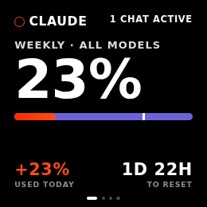
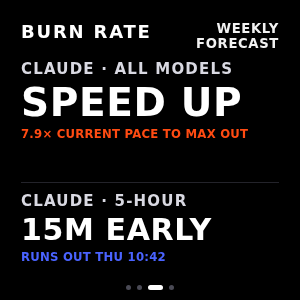
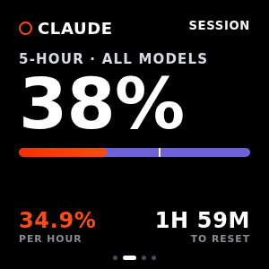

# burnwatch

**A desk widget for your Claude Code rate limits — how much of the weekly and
5-hour allowance is gone, how fast you are burning it, and whether you run dry
before the reset.**

Claude Code will tell you your usage percentage if you go looking for it.
burnwatch puts it on your desktop and, more usefully, turns it into a *rate*:
at the pace of the last day, do you finish the week with allowance to spare, or
does it run out on Thursday morning?

> Built after seeing someone put the same idea on an ESP32-S3. It runs on
> Cloudflare Workers and speaks plain JSON, so the desktop widget, the Wear OS
> app and a future firmware are all clients of one feed.

<p align="center">
  
  
  
</p>

---

## How it works

```
  Claude Code (any machine)         Cloudflare                  clients
  ┌──────────────────────┐         ┌──────────────┐        ┌─────────────────┐
  │ statusLine collector ├─POST───▶│  Worker + D1 │◀─GET───┤ desktop widget  │
  │  every machine you   │ /ingest │  forecast    │ /api/  │ browser         │
  │  code on             │         │  + widget    │ state  │ ESP32-S3 (todo) │
  └──────────────────────┘         └──────────────┘        └─────────────────┘
```

Claude Code pipes a JSON payload to its `statusLine` command on every render,
and that payload carries the real rate-limit block:

```json
"rate_limits": {
  "five_hour": { "used_percentage": 12.5, "resets_at": 1786610276 },
  "seven_day": { "used_percentage": 23.0, "resets_at": 1786772276 }
}
```

Three things follow from using that as the source:

- **It is documented and supported.** No OAuth token is copied anywhere and no
  undocumented endpoint is called, so a Claude Code release cannot quietly
  break it.
- **The numbers are account-wide.** One reading already covers every machine on
  the account, phones included. Parsing local transcript files would only ever
  see the usage produced on the machine doing the parsing.
- **You need one endpoint, not one per machine.** Any machine running the
  collector reports the same account totals.

The block is absent before a session's first API response, and for accounts
without a Claude subscription. The collector forwards whatever it was handed.

## Burn rate and forecast

Percentages alone do not tell you whether you are in trouble. Every rate is
measured against **wall-clock time**, because a gap in the samples is real
information: the collector only reports while Claude Code runs, and usage only
accrues while Claude Code runs. Six quiet hours are six hours of genuine zero
burn, not missing data.

| Verdict | Meaning | Headline |
|---|---|---|
| `speed_up` | You will not use the allowance before it resets | `7.9× CURRENT PACE TO MAX OUT` |
| `on_pace` | Landing near 100% right around the reset | `ON PACE` |
| `runs_out` | You hit 100% early | `2D 4H EARLY`, plus the wall-clock time |

The multiplier is `required_pace / current_pace`, where the required pace is
what it would take to finish exactly at the reset. Worked example: 23% used
with 47h left and +5%/day observed gives a required `77/47 = 1.64 %/h` against
an observed `5/24 = 0.21 %/h` — so **7.9×**.

**burnwatch would rather say nothing than say something it cannot support.** A
window reads `null` between its own reset and the first reading of the window
that replaces it, and `used_today_pct` is `null` when the stored series does not
reach back to local midnight. Both used to be filled in with a stale or invented
number, which is a worse failure for a monitor than a blank.

## Deploy

You need a Cloudflare account. The free tier covers this comfortably — a busy
day of collecting is a few thousand requests against a limit of 100,000.

```bash
git clone https://github.com/kanylbullen/burnwatch
cd burnwatch
bun install          # or npm install

cp wrangler.example.jsonc wrangler.jsonc
npx wrangler d1 create burnwatch
```

`wrangler.jsonc` is git-ignored, because it ends up holding your own database id
and hostname. Paste the printed `database_id` into it, then:

```bash
npx wrangler d1 migrations apply burnwatch --remote
npx wrangler secret put BURNWATCH_TOKEN      # paste a long random string
npx wrangler deploy
```

Generate the token with something like `openssl rand -base64 24`. Keep it: every
collector needs it.

The Worker **refuses every request** while `BURNWATCH_TOKEN` is unset, rather
than treating an empty token as "authentication disabled". A half-finished
deploy has to fail closed on a public endpoint.

Deploying prints a `*.workers.dev` URL. To use your own hostname, add a route in
the Cloudflare dashboard or a `routes` entry in `wrangler.jsonc`.

## Collectors

The collector prints a normal status line — `Opus 5 · myproject · 5h 41% ·
7d 24%` — and reports in the background.

Both collectors require **curl**, and the POSIX one also requires **jq**, which
it uses to cut the payload down before anything leaves the machine.

Only three fields are sent: the session id, the model, and the rate-limit
block. Claude Code's status-line payload also carries the transcript path, your
working and project directories, the git remote's owner and repository, open
pull request numbers and URLs, and agent and session names — none of which is
needed to compute a percentage, and all of which used to be forwarded verbatim
to whoever hosts the endpoint.

### Linux / macOS

```bash
git clone https://github.com/kanylbullen/burnwatch ~/burnwatch
mkdir -p ~/.burnwatch && chmod 700 ~/.burnwatch
printf 'BURNWATCH_URL=https://burnwatch.example.workers.dev\nBURNWATCH_TOKEN=YOUR_TOKEN\n' > ~/.burnwatch/env
chmod 600 ~/.burnwatch/env
chmod +x ~/burnwatch/collector/statusline.sh
```

Then add to `~/.claude/settings.json`:

```json
"statusLine": {
  "type": "command",
  "command": "/home/you/burnwatch/collector/statusline.sh"
}
```

The POST is detached, so the render never waits on the network: measured at
~15 ms even when pointed at an unroutable address.

### Windows

Copy `collector/burnwatch.env.example` to `collector/burnwatch.env` beside the
script and fill in the URL and token, then add to
`%USERPROFILE%\.claude\settings.json`:

```json
"statusLine": {
  "type": "command",
  "command": "powershell -NoProfile -ExecutionPolicy Bypass -File C:/Users/you/burnwatch/collector/statusline.ps1"
}
```

**Use forward slashes in that path** — see [Gotchas](#gotchas); with
backslashes it fails silently and nothing is ever reported.

Be aware of the cost here: this one posts synchronously, and a render costs
roughly **600 ms**, of which ~266 ms is PowerShell starting up. When the
endpoint is unreachable a render can block for up to 2 s, after which a breaker
suppresses further attempts for 60 s — so that stall recurs about once a minute
until it recovers. A small compiled collector is on the roadmap for this reason.

### Both platforms

Claude Code reads `statusLine` at startup, so **restart any running session**
before expecting data.

### Presence, for headless sessions

The status line never runs outside the interactive terminal. To have a machine
appear in the host list even when you work in an IDE, on the web, or through
the SDK, add the presence hook — it sends the machine's name and nothing else:

```json
"hooks": {
  "SessionStart":     [{ "hooks": [{ "type": "command", "command": "/home/you/burnwatch/collector/presence.sh" }] }],
  "UserPromptSubmit": [{ "hooks": [{ "type": "command", "command": "/home/you/burnwatch/collector/presence.sh" }] }]
}
```

Hooks fire in every mode, so this works where the collector cannot. The
percentages still come from the poll.

## Polling, for the machines a collector cannot reach

Collectors only fire in terminal sessions. IDE extensions, phones, and any
machine you never set up stay invisible — see [Gotchas](#gotchas).

An optional poller closes that gap entirely. The account's rate limits come
back as response headers on any ordinary API request, so the Worker makes a
deliberately tiny one on a schedule and reads them off:

```
anthropic-ratelimit-unified-7d-utilization: 0.04
anthropic-ratelimit-unified-7d-reset: 1787263200
```

Because the reading is account-wide, one poll covers every device you own.
Enable it with a token from `claude setup-token`:

```bash
npx wrangler secret put ANTHROPIC_TOKEN
```

Without that secret the Worker simply skips the poll, and burnwatch runs on
collectors alone.

Three things to weigh. The request costs a single output token, so the meter
nudges what it measures. The token can run inference as well as report
limits, so a compromised Worker means more than leaked percentages — keep it
somewhere you would keep an API key. And the headers, unlike the status-line
payload, are not a documented interface: if they change, polling stops and the
collectors carry on.

## The widget

Open the deployment in a browser for the zero-build version:

```
https://burnwatch.example.workers.dev/?token=YOUR_TOKEN
```

Add `&page=2&norotate=1` to pin one card. For the real thing — frameless,
always on top, out of the taskbar — take an installer from the
[releases page](https://github.com/kanylbullen/burnwatch/releases): `.msi` or
`.exe` for Windows, `.dmg` for macOS, `.deb` or `.AppImage` for Linux. CI
builds them on each platform, so no toolchain is needed on the machine you are
installing on.

Nothing is code-signed. Windows SmartScreen warns on first run — *More info*,
then *Run anyway*. macOS refuses outright until you allow it under Privacy &
Security, or clear the quarantine flag:

```bash
xattr -dr com.apple.quarantine /Applications/burnwatch.app
```

To build it yourself instead:

```bash
cd widget/src-tauri
cargo build --release
```

Runs on all three desktops, and CI builds and tests it on each. Building needs
Rust, plus the platform's webview:

| | Requirement |
|---|---|
| Windows | WebView2, preinstalled on Windows 11 |
| macOS | Xcode command line tools |
| Linux | `libwebkit2gtk-4.1-dev`, `libsoup-3.0-dev`, `libayatana-appindicator3-dev` |

The binary lands in `widget/src-tauri/target/release/`. On Linux the tray icon
needs a host that shows AppIndicators — KDE and most others do; GNOME needs an
extension.

Point it at your deployment with the `BURNWATCH_URL` and `BURNWATCH_TOKEN`
environment variables, or with a `config.json` in the app config directory:

| | Path |
|---|---|
| Windows | `%APPDATA%\io.github.kanylbullen.burnwatch\` |
| macOS | `~/Library/Application Support/io.github.kanylbullen.burnwatch/` |
| Linux | `~/.config/io.github.kanylbullen.burnwatch/` |

```json
{
  "url": "https://burnwatch.example.workers.dev",
  "token": "YOUR_TOKEN",
  "width": 260,
  "height": 260,
  "always_on_top": true
}
```

Environment wins over the file. Note that the app rewrites that file whenever
you move or resize the window, and writes the token into it in plain text — so
supplying the token by environment does not keep it out of the config directory.

Click to page, drag to move, scroll or arrow keys to navigate. The tray icon
carries the weekly ring and a tooltip with both windows; **right click** opens
the menu — pin, theme, background opacity, discreet mode, quit — since a
frameless window with no taskbar entry has no other way to be closed.

**Discreet mode** leaves nothing on screen. The tray ring is still the ambient
signal, and **left clicking it** summons the window until you look away: moving
focus elsewhere dismisses it, so a peek needs no second click to put away. On
Linux the peek is unavailable — libappindicator exposes a menu and no click
events at all — so the menu remains the only way in there.

## On the wrist

<p align="center">
  
  
  
  
  
</p>

A Wear OS app lives in [`wear/`](wear/): two complication providers, a tile,
and four pages swiped vertically — each window, the verdict, and who is
reporting. It reads `/api/state` over wifi or LTE without a companion phone
app, and it is another client of the same feed, so it required no server work
at all.

The wording is transcribed from the widget rather than reinvented. Two surfaces
describing one account in different vocabulary would read as two tools that
disagree.

**Prefer the tile to a complication.** A complication is drawn by whoever
designed your watch face, and a face is free to bind one, enable it, accept
correct data and still render nothing — with no way to tell that from the
wrist. The tile is its own surface, one swipe from the face, and no face can
opt out of it.

Build and install instructions, including why the APK carries a read-only
token, are in [`wear/README.md`](wear/README.md).

## Self-hosting instead

A Bun daemon with the same API is included, for running this on your own
machine rather than on Cloudflare. It is the older shape and carries the
tradeoffs the Worker exists to avoid: it only reaches machines that can route to
it, and it stops when its host does.

```bash
./install/setup.sh server     # generates a token, writes ~/.burnwatch/env,
                              # installs and starts a systemd user unit
bun run selfhost              # or run it in the foreground
```

The daemon reads `~/.burnwatch/env` itself, so a manual start picks up the same
settings the unit uses. Leaving `BURNWATCH_TOKEN` empty disables authentication
entirely — only do that alongside `BURNWATCH_HOST=127.0.0.1`.

If your machines are on more than one subnet you will also need a firewall rule,
scoped to your own networks rather than to the world:

```bash
sudo ufw allow from 192.168.0.0/16 to any port 8787 proto tcp
```

## The JSON API

`GET /api/state` — the contract any client reads, including firmware. Both this
and `POST /ingest` require the token, sent either as `Authorization: Bearer …`
or as a `?token=` query parameter. The widget's own static files are served
without it.

```jsonc
{
  "ok": true,
  "now": 1786603076,
  "tz": "Europe/Stockholm",
  "active_sessions": 2,         // sessions that reported in the last 15 min
  "hosts": [                    // every host ever seen, newest first
    { "name": "desktop", "last_seen_s": 4, "active": true },
    { "name": "laptop", "last_seen_s": 5400, "active": false }
  ],
  "poll": {                     // the scheduled poll, or null if it never ran
    "last_seen_s": 240,
    "stale": false             // true once it has missed three runs
  },
  "last_contact_s": 0,          // null until a collector has ever reported
  "windows": {
    "seven_day": {
      "pct": 23,
      "resets_at": 1786772276,
      "resets_in_s": 169200,
      "window_length_s": 604800,
      "rate_pct_per_h": 0.2083,
      "required_pct_per_h": 1.6383,
      "pace_ratio": 0.1272,
      "verdict": "speed_up",     // speed_up | on_pace | runs_out | unknown
      "speed_up_x": 7.88,        // null when no burn has been measured
      "runs_out_at": null,       // set only when verdict is runs_out
      "early_by_s": null,        // set only when verdict is runs_out
      "used_today_pct": 1.81,    // null when the series predates local midnight
      "samples": 145,
      "last_change_s": 0         // idleness, NOT health — use last_contact_s
    },
    "five_hour": { }
  }
}
```

A window is `null` before its first sample, and again between its reset and the
first reading of the window that follows.

`POST /ingest` takes Claude Code's status-line JSON, with an optional
`X-Burnwatch-Host` header, and replies `{ ok, recorded, rejected? }`. A reading
outside its window, or a percentage outside 0-100, is counted in `rejected`
rather than stored.

## Configuration

Worker settings live in `wrangler.jsonc` under `vars`, except the token, which
is a secret (`wrangler secret put BURNWATCH_TOKEN`). The self-hosted daemon
reads the same names from the environment or from `~/.burnwatch/env`.

| Variable | Default | Notes |
|---|---|---|
| `BURNWATCH_TOKEN` | *(unset)* | Read and write. Worker refuses all requests without it; daemon treats empty as auth-disabled |
| `BURNWATCH_READ_TOKEN` | *(unset)* | Optional. `GET /api/state` only — for phones, watches and displays |
| `BURNWATCH_TZ` | `Europe/Stockholm` | Drives "used today" and displayed clock times |
| `BURNWATCH_LOOKBACK_7D` | `86400` | Window for measuring weekly pace |
| `BURNWATCH_LOOKBACK_5H` | `3600` | Window for measuring session pace |
| `BURNWATCH_ACTIVE_SESSION_S` | `900` | How recently a session must have reported to count as active |
| `BURNWATCH_RETENTION_S` | `2592000` | Samples older than this are pruned nightly |
| `BURNWATCH_PORT` | `8787` | Self-hosted daemon only |
| `BURNWATCH_HOST` | `0.0.0.0` | Self-hosted daemon only |
| `BURNWATCH_DB` | `~/.burnwatch/burnwatch.db` | Self-hosted daemon only |

## Gotchas

Six things cost real debugging time. They are documented because none of them
announce themselves.

**Forward slashes in the Windows `statusLine` path.** Claude Code runs the
command through bash (git bash) on Windows, where every backslash is an escape
character. `C:\Users\you\...` arrives at PowerShell as `C:Usersyou...`, which
does not exist; PowerShell exits 127 and Claude Code swallows the error. The
status line simply never appears and nothing is reported, with no message
anywhere to say why.

**`System.Net.Http` is not loaded in Windows PowerShell 5.1.**
`[System.Net.Http.HttpClient]::new()` throws "Unable to find type", and inside a
`try`/`catch` that is invisible — leaving a collector that prints a perfect
status line and never reports. The script uses `curl.exe` instead.

**`statusline.ps1` must stay pure ASCII.** PowerShell 5.1 decodes a BOM-less
file as the legacy ANSI code page, so a stray em dash inside a quoted string can
terminate it early. Separately, the console is often not UTF-8, so non-ASCII
*output* has to be built from code points at runtime with
`[Console]::OutputEncoding` forced. CI enforces the ASCII rule.

**CSP source expressions default to the scheme's port.** In the Tauri shell,
`connect-src https://*` permits port 443 only. A deployment on any other port
needs `https://*:*`, or the widget reports "failed to fetch".

**The status line only exists in the terminal.** Every headless mode — the IDE
extensions, web and remote-control sessions, `claude -p`, the SDK — runs with
`--output-format stream-json` and renders no status line, so the `statusLine`
command is never invoked and that machine reports nothing, however correctly it
is configured. Verified by watching the collector's status file stay untouched
through an active extension session.

Nothing else carries `rate_limits`: not hooks, and not the OpenTelemetry
metrics, which count this machine's tokens rather than the account's
percentage.

Two things make this survivable. The [poll](#polling-for-the-machines-a-collector-cannot-reach)
reads the whole account, so usage from a headless session is measured even
though the session cannot report it. And `collector/presence.sh`, wired to the
`SessionStart` and `UserPromptSubmit` hooks, does fire in every mode — it sends
no numbers, only the machine's name, so the host list reflects where you are
actually working.

**Checking whether the collector ran at all.** Both collectors leave their
outcome in `burnwatch-status` in the temp directory (`$TMPDIR` or `/tmp` on
Linux and macOS, `%TEMP%` on Windows), holding a timestamp, the URL and curl's
exit code. If that file is missing entirely, the script was never invoked — a
different problem from one that ran and failed to report.

## Security

Traffic is HTTPS end to end on Cloudflare, and the Worker refuses everything
until a token is set.

**Two tokens, because reading and writing carry different risk.**
`BURNWATCH_TOKEN` does both and belongs on machines that report.
`BURNWATCH_READ_TOKEN` is optional and opens `GET /api/state` alone — put that
one on a phone, a watch or a display, so losing the device cannot put invented
readings into your history.

**Writes are validated, not trusted.** Percentages must be 0–100, strings are
capped, and a reset date must fall inside its own window give or take a day of
clock skew. This matters more than it sounds: the current window is whichever
reaches furthest into the future, so a single reading dated years out would hide
every real one until the row was deleted by hand. Rejected readings are counted
back in the response rather than dropped in silence.

**The token does not stay in the address bar.** Opening the widget as
`?token=…` would leave the secret in browser history, in any bookmark made from
that page, and in the host's request log. The page takes it on arrival, keeps
it in `localStorage`, and rewrites the URL without it; a bare bookmark then
works on later visits. A stored token the server rejects is cleared, since a
bad credential in storage cannot be fixed by reopening the page.

The served page carries its own `Content-Security-Policy` and
`Referrer-Policy: no-referrer` from `widget/src/_headers`, rather than relying
on the browser's defaults.

**Collectors keep the token off the command line.** `/proc/<pid>/cmdline` is
world-readable on Linux, so passing `-H "authorization: Bearer …"` to curl hands
the token to anyone who runs `ps` at the right moment. It goes in a mode-600
curl config file instead. The config file is parsed rather than sourced, so a
file nobody thinks of as code cannot execute as you.

**Writes are rate limited** to 120 a minute per source address, keyed on the
address rather than the host header because that cannot be forged. Every
machine behind one public address shares the bucket, so the ceiling sits well
above what a fleet of status lines produces.

**What is not covered.** `ANTHROPIC_TOKEN`, if you enable polling, is an
inference credential and not a read-only one — Anthropic issues no narrower
scope for this, so a compromised Worker costs more than leaked percentages.
Leave polling off if that trade does not suit you. The desktop widget keeps a
token in `config.json` if you put one there, owner-only, though it will never
write one that came from the environment. And the data itself is undramatic —
percentages, machine names, session ids — but the machine names do describe
your fleet.

The self-hosted daemon serves plain HTTP and is only appropriate on a trusted
network or behind a TLS reverse proxy. Leaving its token empty disables
authentication entirely.

## Development

```bash
bun test           # forecast maths
bun run typecheck  # shared core, daemon and Worker together
bun run dev        # Worker on a local D1 (wrangler dev)
bun run selfhost   # the Bun daemon instead
```

For `bun run dev`, apply the migrations locally once with
`bun run db:migrate:local`, and put `BURNWATCH_TOKEN=…` in a `.dev.vars` file.

The tests cover window rollovers, expired windows, idle gaps counting as zero
burn, lagging machines reporting stale readings, run-out forecasting, the
zero-pace case and time-zone handling. `widget/src/app.js` is the reference
implementation for anyone writing another client — it consumes exactly the
payload documented above.

**Fixtures.** Append `?fixture=<name>` to the widget URL to render a canned
state without touching the database: `empty`, `speed_up`, `on_pace`,
`runs_out`, `maxed`, `stale`, `hosts`. You cannot make a window expire, or run
dry, or gather ten machines on demand, and two layout bugs shipped precisely
because those states were never looked at. Combine with `&page=2&norotate=1` to
pin one card.

## Roadmap

- **ESP32-S3 firmware.** The original inspiration. `/api/state` is the
  interface and the widget is the reference for what to draw.
- **Codex.** No equivalent status-line hook exists, so it needs its own
  collector.
- **A native collector.** The PowerShell one costs ~600 ms per render. A small
  compiled binary would be ~5 ms.
- **Alerts.** Right now you have to look at the widget to learn you are about to
  run out.

## Credits

The idea came from [VibePulse](https://github.com/niclasvestlund-YT/vibepulse)
by Niclas Vestlund — an ESP32-S3 panel showing the same thing on a desk, and
the reason this exists at all. The header-polling technique above is taken
directly from its token server, which solved a coverage problem this project
had given up on. Also MIT.

## License

MIT — see [LICENSE](LICENSE).
