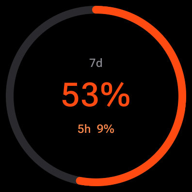
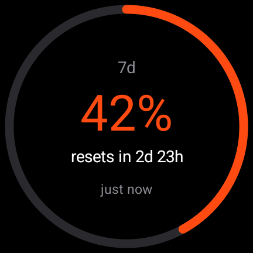
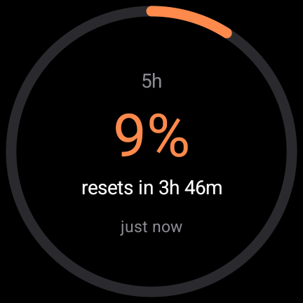
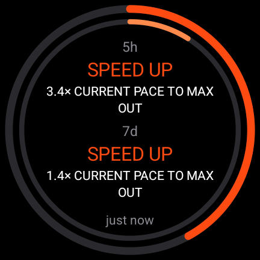
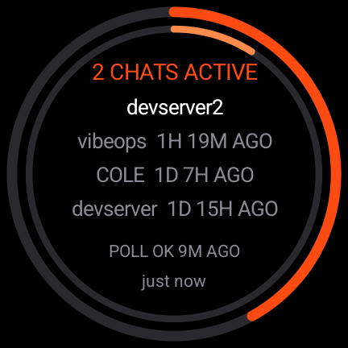

# burnwatch on Wear OS

A tile, two complication providers, and four pages you swipe through — so the
burn is one glance away on the watch face you already wear.

<p align="center">
  
  
  
  
  
</p>

There is deliberately no watch face here. A face is several times the work and
takes something away: you have to abandon the one you like.

There is also no companion phone app. The watch fetches `/api/state` itself
over wifi or LTE, and `com.google.android.wearable.standalone` says so, so
nothing depends on the phone being nearby.

## The tile, and why to prefer it

The tile is the surface to reach for. It is one swipe from the watch face, it
carries the weekly arc with both numbers, and tapping anywhere on it opens the
pages above.

It has to be added once by hand — swipe left to the end of the carousel, tap
**+**, pick burnwatch — because Wear OS does not put newly installed tiles into
the carousel for you.

Prefer it to a complication because a complication is drawn by whoever designed
your watch face, and a face is free to bind one, enable it, accept correct data
and still render nothing. That is not hypothetical: on one Watch Face Studio
face this provider sat in an enabled slot, was handed a valid `SHORT_TEXT`
reading every fifteen minutes, kept a working tap target — and drew no pixels
at all. Nothing on the wrist distinguishes that from a broken app. The tile is
ours, and no face can opt out of it.

## What a complication lands in

| Slot type | Shows |
|---|---|
| `RANGED_VALUE` | The arc, filled to the percentage used, with `59%` and `7d` |
| `SHORT_TEXT` | `59%` with a `7d` title |
| `LONG_TEXT` | `40% · resets in 3d`, or `88% · out 2h 30m early` when it will not last |

All three are offered because a slot advertises which types it accepts, and a
provider offering only the type your slot does not take is simply missing from
the picker — with nothing on the watch to tell you it was ever installed.

An empty slot means one of: nothing fetched and nothing cached, the window has
no readings yet, or the last reading is older than 45 minutes. That last one is
three missed updates, the same threshold the Worker uses before calling its own
poll silent. burnwatch would rather show nothing than a number that may already
be wrong, and this is that rule on a smaller screen.

Tap the complication to open the app, whose four pages say which of those cases
you are in: the five-hour window, the week, the verdict, and the machines that
are reporting.

The pages are swiped **vertically**. On Wear a sideways swipe is the back
gesture, so a horizontal pager would fight the system for the same movement and
lose in a way that feels like a bug.

## Building

The APK carries its credential, because typing a 32-character token on a watch
is miserable and every alternative — a companion app, a pairing code through
the Worker — costs more than the complication itself.

That is only safe because the token is read-only. Use `BURNWATCH_READ_TOKEN`,
which opens `GET /api/state` and nothing else, so a lost watch cannot write
invented readings into your history. **Never put a write token here.**

```sh
cp token.properties.example token.properties
$EDITOR token.properties          # URL + read-only token; gitignored
printf 'sdk.dir=%s\n' "$ANDROID_HOME" > local.properties

./gradlew :complication:testDebugUnitTest
./gradlew :complication:assembleDebug
```

The build refuses to assemble an APK with no deployment compiled in — an
unconfigured build is indistinguishable from a broken network once it is on
your wrist.

Requires JDK 17+ and an Android SDK with platform 35 and build-tools 35.

## Installing

Wear OS sideloading goes over adb, which the watch has to be told to allow:

1. **Settings → System → About → Versions**, tap **Build number** seven times.
2. **Settings → Developer options**, turn on **ADB debugging** and
   **Debug over Wi-Fi**. It shows an IP and port.
3. From the machine that built it:

```sh
adb connect <watch-ip>:<port>
adb -s <watch-ip>:<port> install -r complication/build/outputs/apk/debug/complication-debug.apk
```

Then add the tile. With adb already connected there is no reason to go
hunting for the **+** at the end of the carousel by hand:

```sh
adb -s <watch-ip>:<port> shell am broadcast \
  -a com.google.android.wearable.app.DEBUG_SURFACE \
  --es operation add-tile \
  --ecn component io.github.kanylbullen.burnwatch.wear/.BurnwatchTileService
```

It answers `result=1, data="Index=[0]"` — the position the tile landed at,
counting swipes from the watch face — and `result=0` when it refused.

If you want a complication too, long-press the watch face → **Customize** →
tap a slot → pick **burnwatch weekly** or **burnwatch 5h**.

Two things about wireless debugging will cost you a session otherwise. **The
port is not stable**: Wear OS turns wireless debugging off on its own to save
power and hands it a new random port from the whole ephemeral range each time
it comes back, so a port that worked ten minutes ago is gone. And a failed
`adb connect` tells you which problem you have — *connection refused* means the
watch is on the network but the daemon is down, while a *timeout* means wifi
went to sleep with the screen. Keep the watch on its charger while iterating
and neither happens.

Note also that `adb pair` reports `protocol fault (couldn't read status
message)` when it has really just timed out. Run it under `ADB_TRACE=all` to
see the server return `FAIL` after ten seconds rather than chasing a
handshake bug that is not there.

## Verifying

Everything that decides what appears on the wrist lives in `Rendering.kt`,
`State.kt`, `Forecast.kt` and `Pages.kt`, which hold no Android types, and is
checked in `RenderingTest.kt` and `ForecastTest.kt` against `state-live.json` —
a real response captured from a running deployment with only the host names
changed. A handwritten fixture agrees with whatever its author assumed; this
one disagrees when the Worker's shape moves.

A watch is the least observable surface in this project, so the parts that can
be tested off it, are — and the rest was checked by screenshot over adb rather
than by claiming it looked right.
